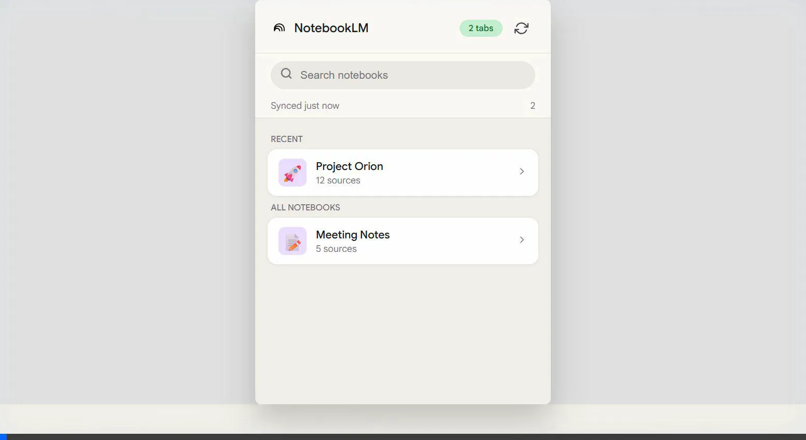

<div align="center">
  
  
  <br/>
  
  <h3><strong>Unlock Your Knowledge Workflows</strong></h3>
  <p>Seamlessly upload active browser tabs to your Google NotebookLM notebooks — right from the toolbar.</p>
  
  <p>
    <a href="#"></a>
    <a href="#"></a>
  </p>
  
  

</div>

***

## ✨ Features

- **🚀 Instant Uploads:** Click the extension logo, pick a notebook, and instantly upload your highlighted tabs as sources.
- **⚡ Smart Refresh & Cache:** Automatically synchronizes and caches your notebooks. Experience lightning-fast load times even on spotty connections.
- **🔍 Quick Search:** Easily find any notebook using the built-in fast search.
- **📱 Native Feel:** Engineered with a sleek aesthetic that beautifully aligns with Google's NotebookLM UI.
- **🔗 Context Menu Support:** Right-click a link and directly upload it to your recent notebooks or prompt the full extension popup.

## 📦 Installation

Since this extension isn't published to the Chrome Web Store yet, you can easily install it by loading it as an unpacked extension:

1. **Clone or Download** this repository to your local machine.
   ```bash
   git clone https://github.com/your-username/NotebookLM-chrome-extension.git
   ```
2. **Open Chrome** and navigate to your extensions page by typing `chrome://extensions/` in the URL bar.
3. **Enable Developer Mode** by toggling the switch in the top right hand corner.
4. Click the **"Load unpacked"** button and select the directory where you downloaded the repository (`NotebookLM-chrome-extension`).

*That's it! You should now see the NotebookLM icon in your toolbar.*

## 💡 How to Use

1. **Pin the extension** for quick access.
2. Ensure you are signed into **[Google NotebookLM](https://notebooklm.google.com/)** in your browser.
3. Navigate to a tab (or highlight multiple tabs by holding `Ctrl`/`Cmd` and clicking them) you wish to add.
4. Click the extension icon in the toolbar, select your desired notebook, and hit **Upload**!
5. **Pro-tip:** Right-click on any hyperlink on a webpage to quickly upload it to your notebooks via the integrated Context Menu.

## 🛠️ Stack & Technologies

- **Vanilla JavaScript** – No bloat, pure speed, and zero dependencies. 
- **Google Extensions V3 API** – Utilizing Manifest V3 for maximum security, background worker stability, and performance.
- **Modern CSS** – Tailored using CSS Variables and animations for lightweight footprint. 

<br/>

<div align="center">
  
  <br>
  <br>
  <i>Built to accelerate learning & research.</i>
</div>
