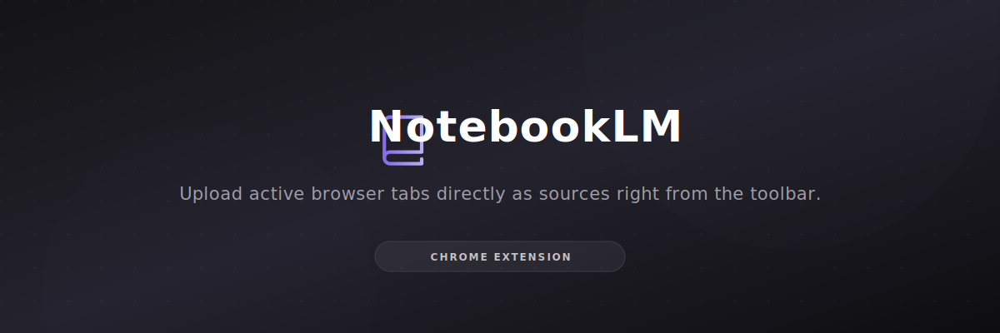
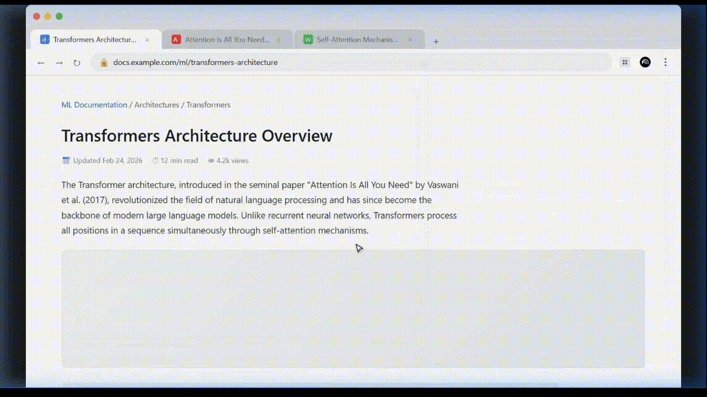

<div align="center">
  
  
  <br/>
  
  <h3><strong>NotebookLM Chrome Extension</strong></h3>
  <p>Upload your open browser tabs straight into Google NotebookLM notebooks, without leaving the page.</p>
  
  <p>
    <a href="#"></a>
    <a href="#"></a>
  </p>
  
  <!-- The recording generated by the subagent -->
  

</div>

***

## ⚠️ Disclaimer
**This is an unofficial extension made for educational purposes.** Not affiliated with or endorsed by Google or the NotebookLM team.

***

## What it does

- **Quick uploads** — Click the icon, pick a notebook, and your selected tabs get uploaded as sources. That's it.
- **Caching & background sync** — Your notebook list is cached locally, so the popup opens fast even if your connection is slow. It syncs in the background when it can.
- **Search** — Type to filter through your notebooks if you have a lot of them.
- **Looks like it belongs** — The UI follows NotebookLM's own design language so it doesn't feel out of place.
- **Right-click to upload** — See a link you want to save? Right-click it and send it to a notebook from the context menu.

## Installation

Not on the Chrome Web Store (yet), so you'll need to load it manually:

1. **Clone or download** the repo.
   ```bash
   git clone https://github.com/your-username/NotebookLM-chrome-extension.git
   ```
2. Go to `chrome://extensions/` in Chrome.
3. Turn on **Developer Mode** (toggle in the top-right corner).
4. Click **"Load unpacked"** and point it at the `NotebookLM-chrome-extension` folder.

You should see the icon in your toolbar after that.

## How to use

1. **Pin the extension** so it's easy to reach.
2. Make sure you're logged into **[NotebookLM](https://notebooklm.google.com/)** in the same browser.
3. Open the tab(s) you want to add — you can select multiple by holding `Ctrl`/`Cmd` and clicking them.
4. Click the extension icon, pick a notebook, and hit **Upload**.
5. You can also right-click any link on a page to upload it directly from the context menu.

## Built with

- **Vanilla JS** — No frameworks, no build step, no dependencies.
- **Manifest V3** — Uses Chrome's latest extension API with service workers.
- **CSS variables + animations** — Keeps the styling clean and easy to tweak.

<br/>

<div align="center">
  
  <br>
  <br>
  <i>Made for people who use NotebookLM a lot.</i>
</div>
